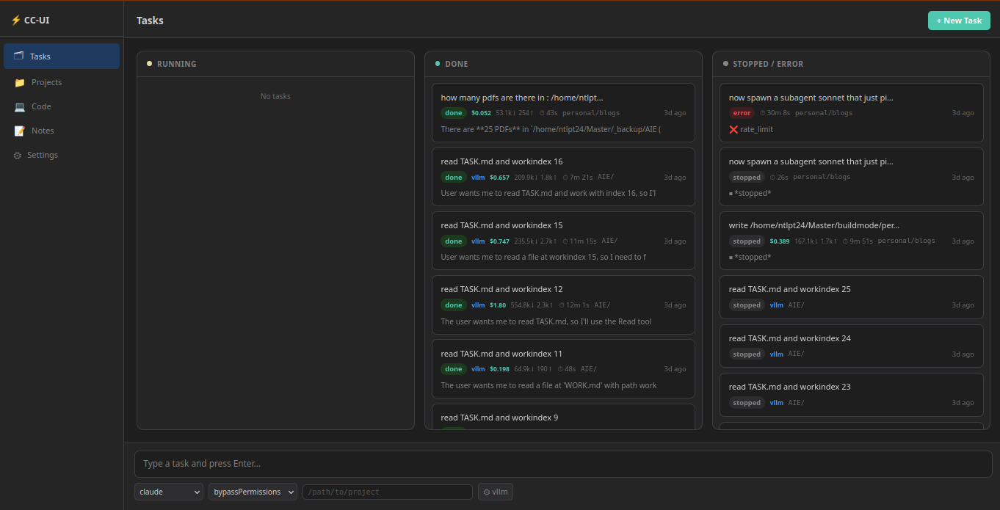

# CC-UI

A simple dashboard for running AI coding agents (Claude Code, Qwen, OpenCode) as background tasks with live git diff.

## Quick Start

```bash
python backend.py
```

Open [http://localhost:8001](http://localhost:8001)



## Features

- **Kanban board** — Tasks organized by status (Running, Done, Stopped)
- **Live chat** — Follow-up conversations with each task
- **Git diff panel** — See what changed while you work
- **Multi-model** — Supports Claude, Qwen, OpenCode, and local vLLM

## How to Use

1. Type a task in the chat bar at the bottom
2. Click a task card to open chat + git diff
3. Send follow-up messages anytime
4. Track progress on the Kanban board

## Settings

Click the gear icon to switch themes (Light, Dark, macOS, Claude).
